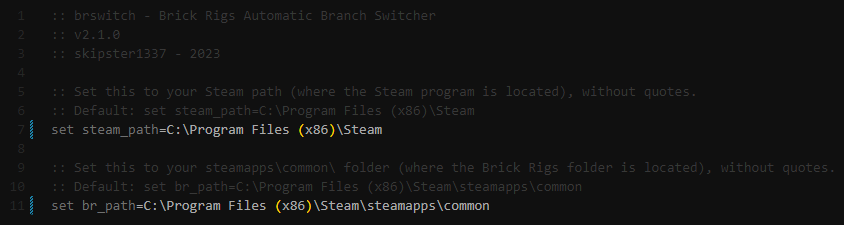

# brswitch
brswitch is a simple script that lets you switch branches for the Steam game Brick Rigs. Currently it allows setting up the three branches of the game side by side (stable, legacy and experimental) and future releases will guide you in installing any older versions of the game as a switchable 'historical' branch.  

brswitch is written in the Windows Batch scripting language which makes it easily modifiable and configurable with the right knowledge, so if you want to use this for another project, you can.  

brswitch works by renaming the game folder and .appmanifest file for the each branch to a codename (like `br_stable`) and keeping them for later. When switching, said codenamed folders are simply renamed to the filenames expected by Steam. This is more efficient than messing with Windows' "symbolic links" because they are somewhat unstable (in my tests, the .appmanifest file's symlink would just merge with every other version, making a huge mess that Steam didn't know what to do with). Renaming is much simpler and is done with some guessing using logic statements in Batch.

# Cool, cool. How do I use this?
- Follow [this link](https://raw.githubusercontent.com/skipster1337/brswitch/main/brswitch.bat) and save the batch file by pressing CTRL+S.
- It should download a .bat file which you will have to put in your `Steam\steamapps\common` folder (or wherever the `Brick Rigs` folder is located for you).

**Note:** an easy way to find your `steamapps\common` directory is to right click on Brick Rigs in your Steam library, choose to browse the local files and go up a level to `common`. That's where you have to save the script.  

Afterwards you should open the file in a text editor (like Notepad) and change the Brick Rigs and Steam paths to the ones that match yours. By default Steam is installed to `C:\Program Files (x86)\Steam` and if you installed it elsewhere you already know what to do. 

# Setting up the folder structure
The first thing you should do is set up your folder structure by installing multiple branches and letting brswitch rename them to their codenames. This is done by choosing the first option in the script.  
The first thing brswitch will ask you is the branch you have currently installed, which will either be legacy or stable (the current 1.x version) depending on what you play.  
brswitch will then rename the selected branch to its codename and proceed with downloading the other branch, and will then give you the option to set up the experimental branch (which is also later accessible in the menu).  

Switching branches is simple and needs no explanation, simply select the option to switch to the required branch.

# 'Historical' version support
soon:tm:

# I don't like this. How do I get rid of it?
If you have decided to remove brswitch you can do so by simply removing the script, backing up your mods from the game folders, deleting the `Brick Rigs` and `br_<branch>` folders from `steamapps\common`, then `appmanifest_552100.acf` and `br_<branch>.acf` from `steamapps`. If you've never used a historical version your saves are not affected.